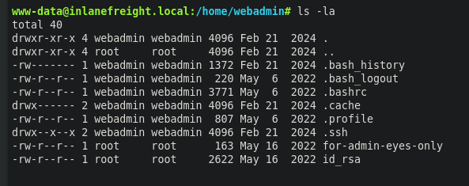
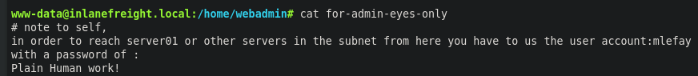
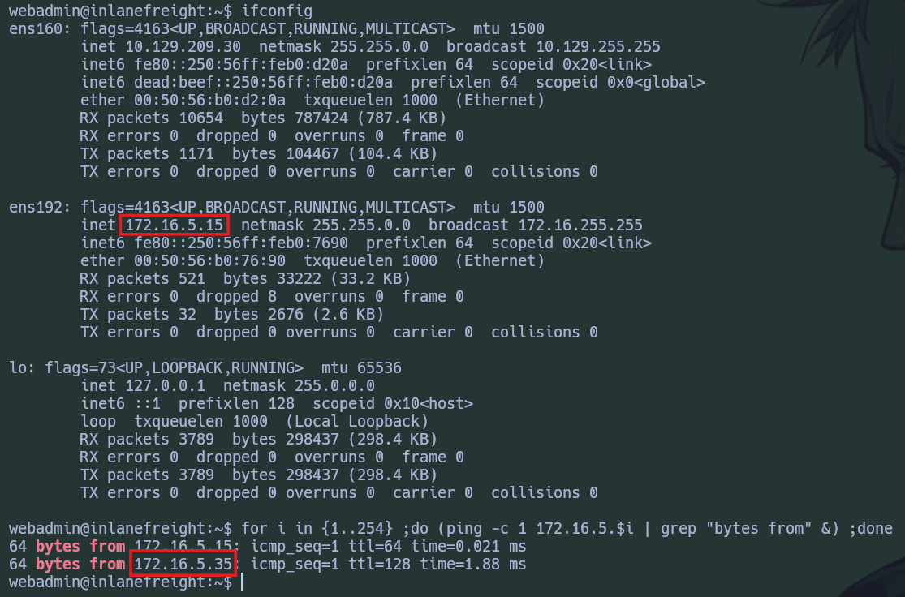
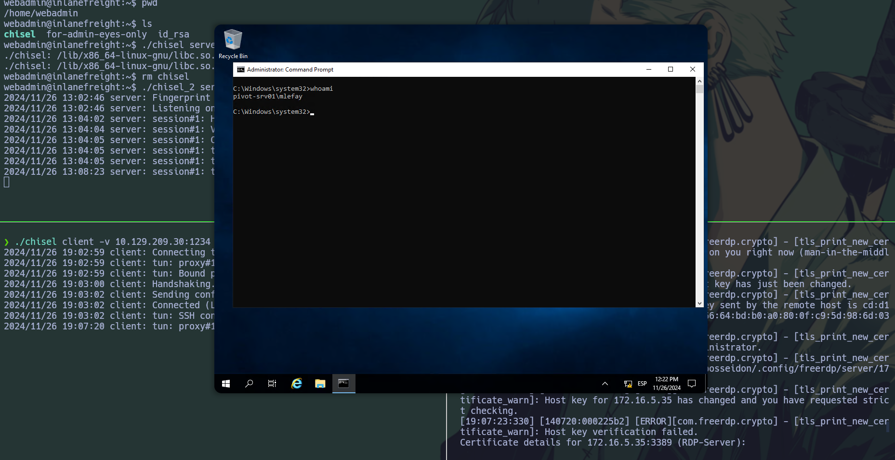
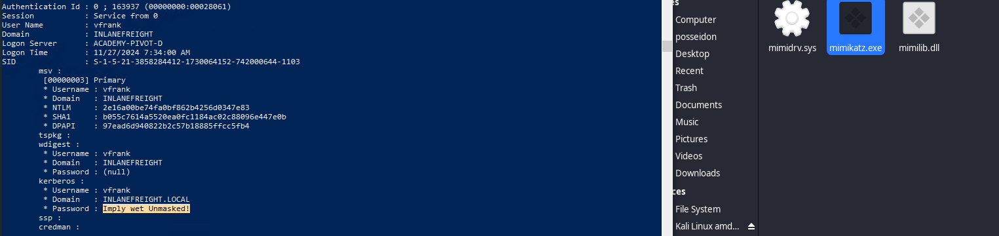
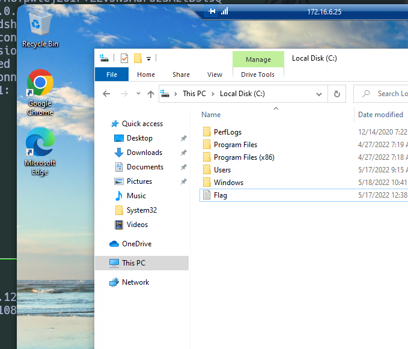
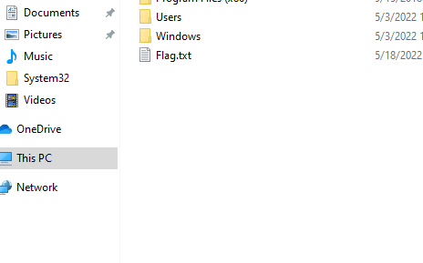

# Escenario

> Un miembro del equipo inició una prueba de penetración contra el entorno de Inlanefreight, pero fue trasladado a otro proyecto en el último minuto. Afortunadamente para nosotros, dejaron una **`web shell`** en su lugar para que podamos volver a ingresar a la red y poder continuar donde ellos lo dejaron. Necesitamos aprovechar el web shell para continuar enumerando los hosts, identificando servicios comunes y usando esos servicios/protocolos para pivotar hacia las redes internas de Inlanefreight. Nuestros objetivos detallados se encuentran a continuación:

## Objetivos

- Comience desde lo externo (Pwnbox o su propia máquina virtual) y acceda al primer sistema a través del shell web que quedó en su lugar.
- Use el acceso al shell web para enumerar y pivotar hacia un host interno.
- Continúe con la enumeración y el pivoteo hasta llegar al controlador de dominio de Inlanefreight y capture la bandera asociada.
- Use cualquier dato, credencial, script u otra información dentro del entorno para habilitar sus intentos de pivoteo.
- Tome todas las banderas que pueda encontrar.

### NOTA

> Tenga en cuenta las herramientas y tácticas que practicó a lo largo de este módulo. Cada uno puede proporcionar una ruta diferente hacia el siguiente punto de pivote. Puede que te resulte sencillo realizar un salto desde un grupo de hosts, pero es posible que esa misma táctica no funcione para llegar al siguiente. Mientras completas esta evaluación de habilidades, te recomendamos que tomes notas adecuadas, dibujes un mapa de lo que ya sabes y planifiques tu próximo salto. Intentar hacerlo sobre la marcha resultará difícil sin tener un elemento visual de referencia.

---

## Preguntas:

### 1. **Once on the webserver, enumerate the host for credentials that can be used to start a pivot or tunnel to another host in the network. In what user's directory can you find the credentials? Submit the name of the user as the answer.**

- [ ] **`wedadmin`**

> Luego de haber acceder a la web shell que nos dejaron los anteriores pentester, podemos navegar por el host y logramos identificar en el directorio **`/home`** a dos usuarios, **administrador** y **webadmin**, en el segundo logramos conseguir una id_rsa que podemos usar como conexión para **SSH**, además de un archivo ***`for-admin-eyes-only`***, al cual luego le podemos dar un vistazo.

---

### 2. **Submit the credentials found in the user's home directory. (Format: user:password)**

- [ ] **`mlefay:Plain Human work!`**

> Al leer el archivo ***`for-admin-eyes-only`*** vemos las credenciales de la respuesta, dichas credenciales deben ser usadas para acceder al **server01** u otros servidores en la subnet.

---

### 3. **Enumerate the internal network and discover another active host. Submit the IP address of that host as the answer.**

- [ ] **`172.16.5.35`**

> Para identificar los hosts en la red interna, utilizamos un **for loop** de bash para hacer un escaneo ICMP. Con esto conseguimos otro servidor interno con la dirección **172.16.5.35**.

---

### 4. **Use the information you gathered to pivot to the discovered host. Submit the contents of C:\Flag.txt as the answer.**

- [ ] **`S1ngl3-Piv07-3@sy-Day`**

> Ahora utilizamos **Chisel** para configurar un túnel SOCKS5 y logramos pivotar hacia el host interno. Esto nos permitió acceder al puerto **3389** de **RDP** con las credenciales previamente encontradas.

---

### 5. **What user is vulnerable?**

- [ ] **`vfrank`**

> Mediante el uso de **Mimikatz**, logramos extraer credenciales en texto claro del usuario **vfrank**, que lo hace vulnerable.

---

### 6. **For your next hop enumerate the networks and then utilize a common remote access solution to pivot. Submit the C:\Flag.txt located on the workstation.**

- [ ] **`N3tw0rk-H0pp1ng-f0R-FuN`**

> Mediante el usuario **vfrank**, identificamos un nuevo segmento de red y logramos conectarnos a la máquina **172.16.6.25** mediante **RDP**.

---

### 7. **Submit the contents of C:\Flag.txt located on the Domain Controller.**

- [ ] **`3nd-0xf-Th3-R@inbow!`**

> Accedimos a un recurso compartido en el controlador de dominio donde encontramos la última bandera.

---

## Conclusiones

> Esta práctica del módulo **`Pivoting, Tunneling, and Port Forwarding`** de [**Hack The Box Academy**](https://academy.hackthebox.com/module/details/158) es una excelente forma de poner en práctica cómo se mueven los atacantes en una red empresarial segmentada, encontrando un **Host de Pivoteo** como punto de apoyo para comprometer otros sistemas.

---
